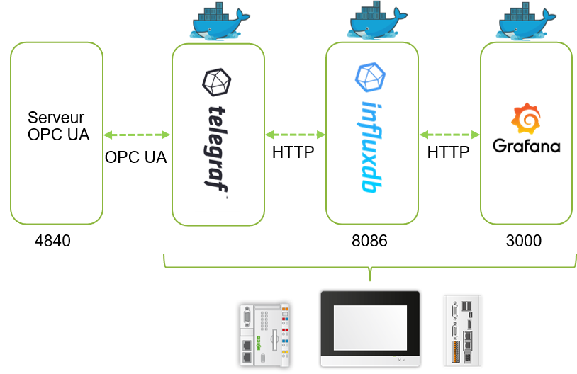

# opcua-tig


## Description
Ce dépôt contient tout le nécessaire pour installer l'ensemble de containers suivant l'architecture suivante : 
<div style="text-align: center">

</div>

Des variables sont collectées au sein du serveur OPC UA au travers d'une connexion sécurisée (TLS) via l'applicatif Telegraf. Ce dernier poste les informations dans une base InfluxDB dans un container dédié.
Enfin les données sont affichées via l'outil de visualisation Grafana. 
Le serveur OPC UA peut aussi bien être interne que distant. 
L'outil de gestion de containers Portainer est également installé pour faciliter la maintenance des containers. 

Le script bash permet d'automatiser l'installation de Docker sur la carte SD, le téléchargement des images Docker, fichiers de configuration et package nécessaires et leurs installations.
Le script génère également les certificats et clés nécessaires pour l'échange OPC UA sécurisé (TLS).

## Prérequis

Ce script fonctionne sur les plateformes suivantes : 
- PFC200 G2
- Touch Panels 600
- Edge Controller

Le contrôleur doit être démarré depuis la flash interne, pas depuis une image bootable sur la carte SD.
Une carte SD (/media/sd) doit être insérée et préalablement formatée en ext4 via le WBM (Docker sera installé sur la carte SD).

Le PFC, Edge Controller ou TP600 doit disposer d'un accès à Internet (penser à renseigner DNS et Gateway).

La date et heure du contrôleur doivent être mises à jour pour éviter des erreurs lors de l'échange TLS. 
Dans le WBM, mettre à jour l'heure dans <em>Configuration / Clock</em> ou spécifier un serveur de temps dans <em>Ports and service / NTP Client</em>

## Installation
Se connecter en SSH au contrôleur via PuTTy par exemple, en tant que super utilisateur (<em>root / wago</em> par défaut, penser à le modifier).

Exécuter la commande suivante qui permet le téléchargement de ce script, lui donne les droits d'exécution et l'exécute.

```
wget https://raw.githubusercontent.com/quenorha/opcua_tig/main/install.sh -P /media/sd/ && chmod +x /media/sd/install.sh && /media/sd/install.sh
```

## Configuration
 
###  1) Certificats TLS

Si besoin, modifier le fichier <b>/root/config/ssl.conf</b> pour renseigner les informations du certificats au niveau de [ subject ].
Il faut regénérer les clés et certificats via la commande suivante : 
```
openssl req -x509 -days 365 -new -out /root/certs/certificate.pem -key /root/certs/key.pem -config /root/config/ssl.conf
```

### 2) Telegraf
Le fichier <b>/root/config/telegraf.conf</b> (dans le dossier /root/config) doit être adapté pour renseigner l'adresse IP du serveur OPC UA, ainsi que les variables à lire. 
Pour obtenir l'identifiant de la variable OPC UA, se connecter avec le client UAExpert au contrôleur, puis cocher la vue <em>View / Attributes</em>.
Naviguer jusqu'aux variables, l'identifiant apparaît à droite au niveau de <em>Identifier</em>, copier la valeur.
Saisir les variables au niveau de la configuration OPC UA dans le fichier de configuration : 
 ```
  nodes = [
    {name="Var1", namespace="4", identifier_type="s", identifier="|var|WAGO 750-8210 PFC200 G2 4ETH.Application.PLC_PRG.iTest001"},
    {name="Var2", namespace="4", identifier_type="s", identifier="|var|WAGO 750-8210 PFC200 G2 4ETH.Application.PLC_PRG.iTest002"},
    ] 
  ```
Une fois la configuration modifiée, redémarrer le container Telegraf. 
 ```
 docker restart c_telegraf
 ```	 
Consulter les logs pour vérifier le bon fonctionnement (également possible depuis Portainer)
```
docker logs c_telegraf
```		 

La première connexion peut prendre plus de temps en raison de l'échange TLS, il est donc normal que ce messages d'erreur apparaîssent dans le logs du container Telegraf : 
```
 W! [inputs.opcua] Collection took longer than expected; not complete after interval of 1s
```
Si en revanche ce message se répète il y a peut être un problème dans la configuration du serveur, ou bien le certificat a été rejeté. 
Pour vérifier si le certificat a été rejeté et éventuellement l'autoriser, il faut utiliser le mécanisme GDS Push. Se connecter avec le client UAExpert (en mode sécurisé). 
Aller dans <em>Document / Add</em>, sélectionner GDS Push View puis cliquer sur Add. 

Au niveau de <em>Server Certificate Groups</em>, le certificat généré précédemment doit apparaître, accompagné d'un croix rouge. Cliquer droit dessus puis sur <em>Trust</em>.
La communication OPC UA devrait fonctionner. 
